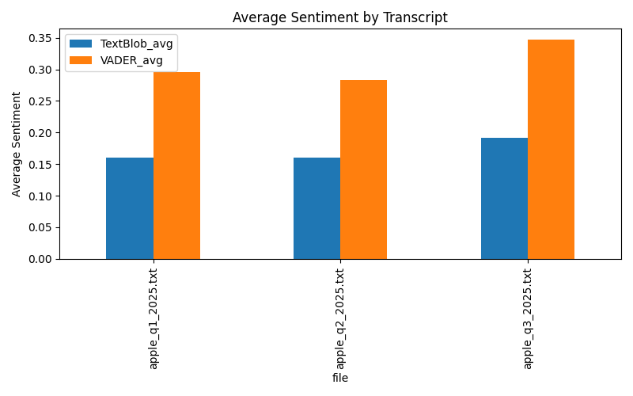

# EARNINGS CALL SENTIMENT ANALYZER

Evaluates the 'tone' in earnings call transcripts using natural language processing, compares sentiment between speakers, and links stock price movements to executive communication.

## WHAT IT DOES

- Cleans transcripts of superfluous elements and splits what remains into sentences. 
- Runs using two sentiment analysis models: TextBlob & VADER.
- Aggregates data sorted by the specific earnings call transcript & by individual speaker.
- Plots the following on graphs: speaker averages & sentence-by-sentence trend line overview.
- Exports CSV files for easy use in things like Excel.
- Pulls real stock data (Yahoo Finance) and shows the amount the stock changed post-earnings-call.
- Comparison: sentiment sentiment analysis vs. stock reaction

## WHY THIS MATTERS! (FINANCE-ORIENTED)

Lets you study how management tone lines up with short-term moves after the call.

## SETUP

```bash
python3 -m venv .venv
source .venv/bin/activate
pip install -r requirements.txt
python src/hello.py
```

## EXAMPLE

See `data/` for a sample transcript and the exported CSVs. 

CSV files are stored in `data/` folder after each run.

See `figures/` for example charts.

## NOTES

This repo is under active development.  
What is coming soon: more advanced sentiment models for better accuracy, a prediction model, new webapp.

## Example Results 

Below are example outputs generated from real Apple earnings call transcripts (Q1-Q3 2025).

### Average Sentiment by Speaker


### Sentiment Trend Across Transcript


### Comparison Across Multiple Transcripts


### Sentiment vs. Stock Reaction


Last updated: October 2025 